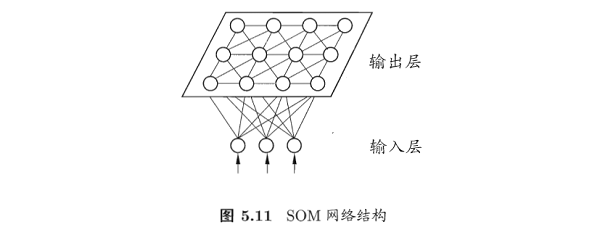
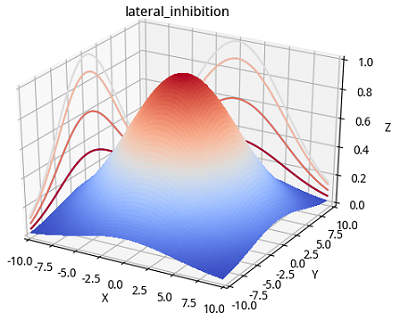
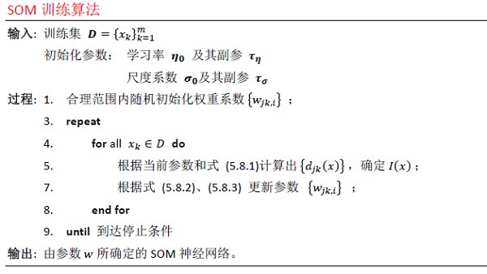
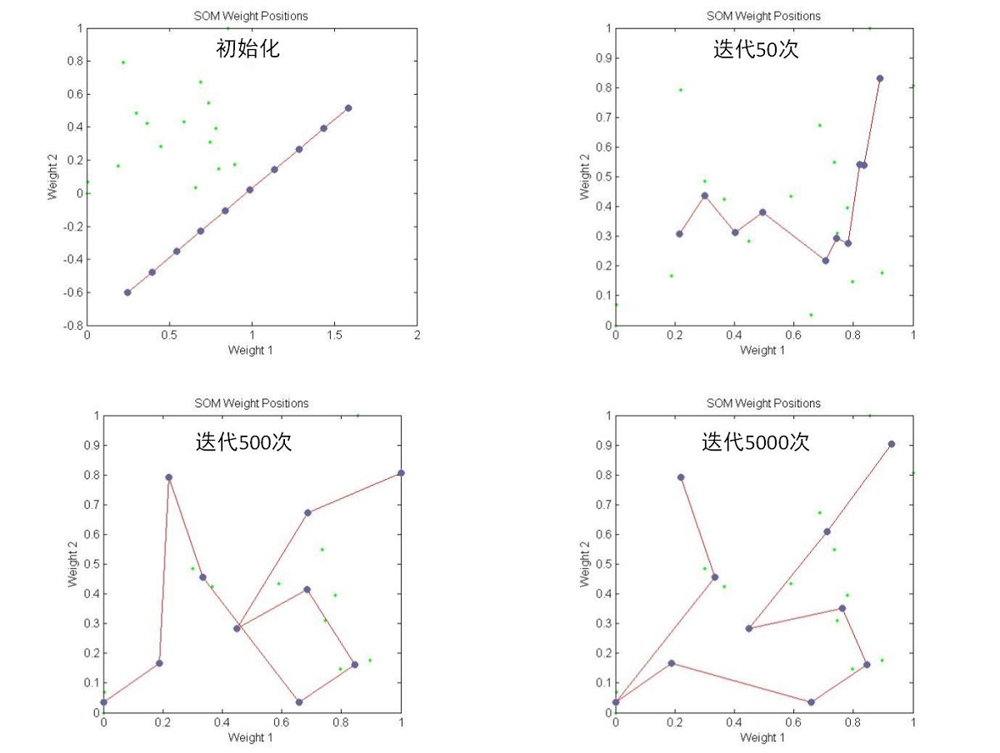
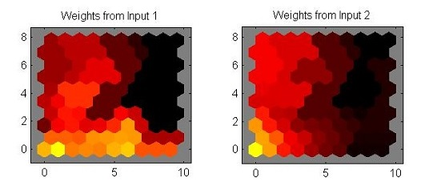

本系列相关答案和源代码托管在我的Github上：[PY131/Machine-Learning_ZhouZhihua](https://github.com/PY131/Machine-Learning_ZhouZhihua).

# SOM神经网络实验 #

> 

注：本题程序分别基于Python和Matlab实现（[这里查看完整代码和数据集](https://github.com/PY131/Machine-Learning_ZhouZhihua/tree/master/ch5_neural_networks/5.8_SOM)）。

## 1 基础概述 ##

### 1.1 SOM网络概念 ###

SOM(Self-Organizing Map，自组织映射)网络是一种**无监督**的**竞争型**神经网络，常用于数据的**聚类和降维分析**。它从仿生学中引出，模拟了面临不同输入模式时生物神经组织的兴奋机理。SOM神经网络最初由Kohonen提出，所以也常把SOM网络称为**Kohonen网络**。

SOM神经网络通过自组织映射（SOM），将高维的输入数据映射到低维空间，从而实现了特征空间的降维，同时保持了输入数据在高维空间中的拓扑结构。下图为最常见的输出层为二维的SOM神经网络：



SOM网络经过训练之后，输出层各神经元及其参数反映的是输入数据的模式聚合。

### 1.2 SOM网络工作机理 ###

SOM工作机理分为三大部分：

 - 竞争（Competition）
 - 协同（Cooperation）
 - 适应（Adaption）
 
下面对工作机制进行概要讨论（这里以上图5.11所示输出层为二维的Kohonen网络为例）：

**1. 参数**

先明确网络所涉及的数据和参数（即要通过数据学习的对象）：
	
	数据：
		输入层：D 个输入变量记为 x = {x_i: i=1,…,D};
		输出层：N*M 个输出变量记为 o = {o_jk: j=1,…,N;k=1,…,M};
	
	参数：
		优胜邻域系数(j1k1和j2k2) T = {T_j1k1j2k2: j1,j2=1,…,N;k1,k2=1,…,M}，和距离远近有关;	
		学习率 η，和迭代次数有关；
		输出层第 jk 个神经元相对于输入层的权重参数 w_jk = {w_jki: j=1,…,N;k=1,...,M;i=1,…,D}，对应该神经元模式属性；	

下面将进一步解释这些参数及其使用。

**2. 竞争机制（Competition）**

我们需要一个**判别函数**来确定，在某条输入样本下，胜出的是输出层的那一个神经元，这里可采用**欧氏距离**来度量，通过计算输出层神经元 o_jk 和 输入之间的距离，越小的胜出。判别函数如下式，记胜出的神经元索引为 I(x)，可以看出这里起决定性作用的参数是权重 w：

	

**3. 协同机制（Cooperation）**

SOM网络根据**优胜邻域**进行权值调整（**侧抑制(lateral inhibition)**机制），即对于所有输出层神经元，越靠近胜出者权值调整幅度越大，我们可用下面的衰减函数来度量这样一种权值调整幅度：

	

可以绘制出该函数示意如下图示（可以看出其取值规律符合侧抑制机理）：



**4. 参数更新机制（Adaption）**

参数更新针对权重 w，直接给出更新公式如下：


为优化收敛，防止振荡，可采用随迭代次数衰减的学习率，同理可调整上面侧抑制函数中的尺度系数 σ，一并给出其计算式样例如下:


### 1.3 SOM网络训练算法 ###

根据上面的记述，给出SOM网络训练算法概略如下：



## 2 简要实验 ##

这里我们采用西瓜数据集3.0a作为分析对象，采用SOM神经网络来分析其输入变量的聚类情况，并与实际类别对比。

### 2.1 数据预处理 ###

对象数据集（watermelon_3a）如下所示：


数据样本为二维连续输入和一维标称输出，绘制其可视化散点图如下所示：


从数据点的分布可以得到一些基本信息（如线性不可分，存在离群点，每类样本量平衡等）。

由于算法中涉及到**距离**的计算，这里需要将数据集的每个属性进行**归一化**（正则化）（含糖率、密度）。

采用Z-score的归一化的python程序样例如下：
	
	```python
	# data normalization (z-scale) based on column
	X_train = np.zeros(X.shape)
	for j in range(X.shape[1]):
	    for i in range(X.shape[0]):
	        X_train[i,j] = (X[i,j] - X[:,j].mean())/X[:,j].std()
	X = X_train
	```

采用Max-min归一化的Matlab语句样例如下：

	```matlab
	X = mapminmax(X, 0, 1);
	```

### 2.2 模型训练 ###

这里我们采用两种方式互补实现此处SOM网络的实验：

 1. 基于**python的pymvpa2机器学习包**实现；
 2. 基于**Matlab的神经网络工具箱**（Neural Network Toolbox）实现；

下面主要讲述实现思路：

 1. 为体现SOM的数据降维功能，搭建网络时设置其Kohonen层（竞争输出层）为一维，（注pymvpa2包不支持1维，可设置其竞争层size为 n*2 来近似研究）。
 2. 执行参数训练的迭代过程，查看输出层（竞争层）的神经元类别所属情况：

### 2.3 结果分析 ###

首先查看神经元权重参数（记忆参数） w 的变化结果（神经元记忆中心运动情况）：




在Matlab-神经网络工具箱上实现SOM网络并训练得到竞争层（size = 10*1）的神经元映射结果图：


可以看出此时SOM网络竞争层以大致从输入中提取出1，2两类（且对应神经元数量相当），这与样本真实情况相符，但是由于样本中离群点的存在，导致出现了异类（3）。

进一步，若不考虑降维，采样pymvpa2包搭建一个2维Kohonen层（竞争层），经过多次训练后得出下面的权重着色图：



可以看到，权重值存在渐变，说明存在类簇的作用。

## 3. 总结 ##

这里对SOM网络进行初步的学习探索，可以看到它在**数据降维**，**聚类分析**上的优势。

进一步可知，SOM网络的聚类**无需事先指定类别数量**，是一种完全自主的实现（这点不同于K-means等聚类方法）。

经过训练的SOM网络可以进一步实现**分类预测**等更多功能。

## 4. 参考 ##

 (注：sompy是本文实现过程中可用到的一个python软件包，未在文中提出)

 - SOM神经网络基础知识： [伯明翰大学课件：Self Organizing Maps: Fundamentals](http://www.cs.bham.ac.uk/~jxb/NN/l16.pdf)
 - Python辅助-pymvpa： [官方](http://www.pymvpa.org/index.html)
 - Python辅助-pymvpa： [Self-organizing Maps样例](http://www.pymvpa.org/examples/som.html)
 - Python辅助-sompy： [SOM软件包：sompy_GitHub](https://github.com/sevamoo/SOMPY)
 - Python辅助-sompy： [sompy使用_CSDN博客](http://blog.csdn.net/u013554860/article/details/53984133)
 - Python辅助-sompy： [sompy使用_官方examples](http://nbviewer.jupyter.org/gist/sevamoo/f1afe78af3cf6b8c4b67)
 - Matlab辅助-神经网络工具箱： [SOM自组织特征映射神经网络](http://blog.sina.com.cn/s/blog_7671b3eb0100y4kl.html)
